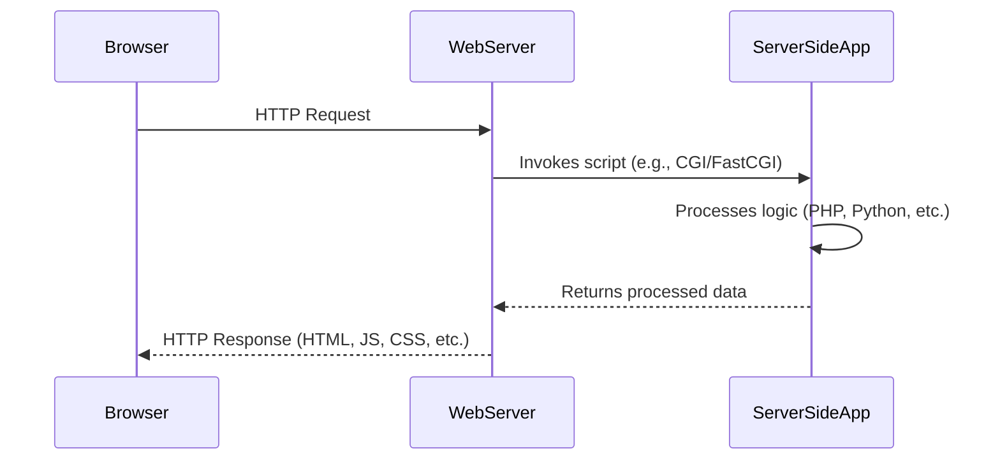
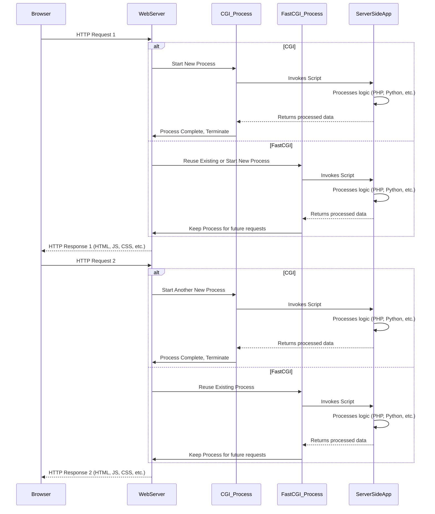

## 1. Протокол HTTP. Структура запросов и ответов, методы запросов, коды ответов сервера, заголовки запросов и ответов.

`HTTP` - HyperText transfer protocol.
> Это просто протокол для обмена *гипертекстом*.

- `Идемпотентность` - в контексте http-методов означает что многократное выполнение одного и того же запроса приводит к одному и тому же результату *без побочных эффектов*.

## 2. Язык разметки HTML. Особенности, основные теги и атрибуты тегов.

`HTML` - HyperText markup language.
> Это просто язык разметки *гипертекста*.

## 3. Структура HTML-страницы. Объектная модель документа (DOM).

`<!DOCTYPE html>` - задание версии html. В данном случае, это html5

## 4. HTML-формы. Задание метода HTTP-запроса. Правила размещения форм на страницах, виды полей ввода.

<form>

## 5. Каскадные таблицы стилей (CSS). Структура - правила, селекторы. Виды селекторов, особенности их применения. Приоритеты правил. Преимущества CSS перед непосредственным заданием стилей через атрибуты тегов.

`CSS` - Cascading style sheet.
> Это просто каскадная таблица стилей шобы красивые сайты делать

## 6. LESS, Sass, SCSS. Ключевые особенности, сравнительные характеристики. Совместимость с браузерами, трансляция в "обычный" CSS.

`Это типа препроцессоры`

## 7. Клиентские сценарии. Особенности, сферы применения. Язык JavaScript.

`Клиент всегда прав`

## 8. Версии ECMAScript, новые возможности ES6 и ES7.

`Возможностей нет, скипаем`

## 9. Синхронная и асинхронная обработка HTTP-запросов. AJAX.

`Юзайте асинхронную и будет вам счастье`

`AJAX` - asynchronous Javascript and XML

## 10. Библиотека jQuery. Назначение, основные API. Использование для реализации AJAX и работы с DOM.

`jQuery надо чтоб манипулировать DOM` - DOM, это там, где я могу расслабиться и забыть обо всех жизненных проблемах

## 11. Реализация AJAX с помощью SuperAgent.

## 12. Серверные сценарии. CGI - определение, назначение, ключевые особенности.

Basic CGI interaction diagram

## 13. FastCGI - особенности технологии, преимущества и недостатки относительно CGI.

In-depth CGI, FastCGI interaction diagram

## 14. Язык PHP - синтаксис, типы данных, встраивание в веб-страницы, правила обработки HTTP-запросов. Особенности реализации принципов ООП в PHP.